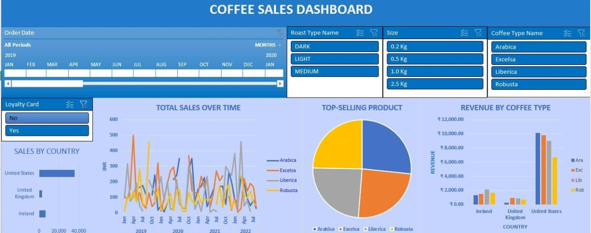

# Coffee Sales Dashboard

## Overview

This project presents a **Coffee Sales Dashboard** built using **Excel**, providing key insights into sales performance, trends, and revenue generation. The dashboard visually represents data to help stakeholders make data-driven decisions.

## Dataset

- The initial dataset source is **coffeeOrdersData.xlsx**.
- The dashboard is created on this **COFFEE_SALES_DASHBOARD.xlsx**.
- The first sheet contains the interactive **Excel Dashboard** summarizing key sales metrics.

## Features

- **Sales by Country:** Breakdown of total sales by country.
- **Total Sales Over Time:** Visual representation of sales trends over time.
- **Top-Selling Product:** Insights into the best-selling coffee products.
- **Revenue by Coffee Type:** Revenue distribution across different coffee types.
- **Timeline Integration:** Allows users to explore data over different time periods.
- **Slicers for Customization:** Includes filters for **Roast Type Name, Size, Coffee Type Name, and Loyalty Card** to enable dynamic analysis.

## Dashboard Preview



## How to Use

### 1. Download the Dataset & Dashboard

Clone this repository or download the Excel file.

```bash
git clone https://github.com/charu-dharshana/coffee_sales_dashboard.git
```

### 2. Open the Excel file

Open `COFFEE_SALES_DASHBOARD.xlsx` and navigate to the first sheet to view the dashboard.

### 3. Interact with Filters

Use slicers and dropdowns to analyze sales trends dynamically based on **Roast Type, Size, Coffee Type, and Loyalty Card**.

## Future Enhancements

- Convert this dashboard into an interactive **Power BI/Tableau Dashboard**.
- Automate data updates using **Python & Pandas**.
- Deploy an interactive **web-based dashboard** using **Streamlit/Dash**.

